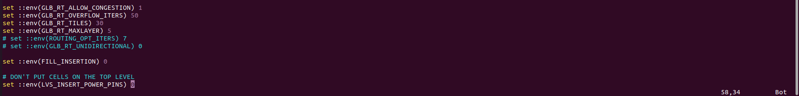
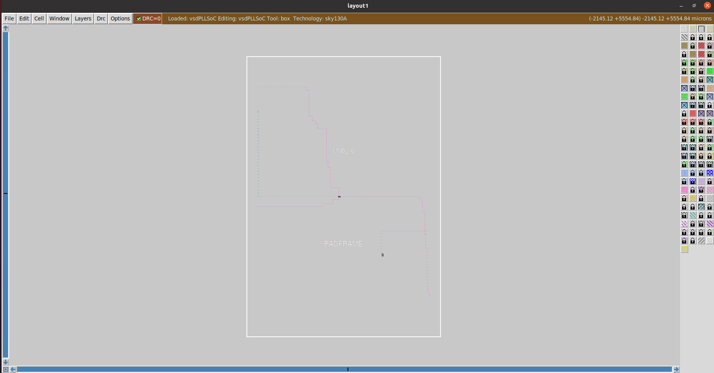
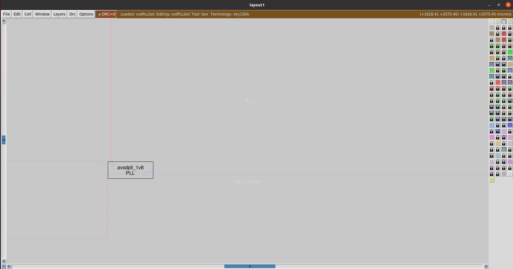

# SoC Implementation flow with pads, On-chip PLL block (avsdpll_3v3), and PLL control circuit

This is the cofiguration TCL file for the design SoC_flow_chip_io:

This is the layout of the SOIC-24 with pads:

Below, we have a configuration TCL file for the design SoC_flow_openlane:

Below, we have a layout which contains three instances pads, avsdpll_1v8 and POR:

We referred to the following github link https://github.com/rsnkhatri3/vsdPLLSoC.git files to implement our own SoC design.
